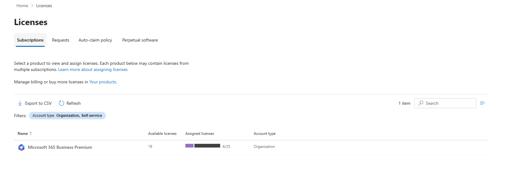

# Microsoft Entra ID Lab — Perform Basic Group Management Tasks

**Status:** Completed ✅  
**Environment:** Microsoft Entra ID + Microsoft 365 Business Premium  
**Tenant:** ExposedCybersecurity  
**Date completed:** 2 September 2026  
**Microsoft Lab:** [Exercise — Perform basic Group Management tasks](https://microsoftlearning.github.io/Get-started-Microsoft-Entra-Management-Tasks/Instructions/Labs/02-perform-basic-group-management.html)

---

## Overview

In this lab, I practiced basic group-management tasks that an IAM or Microsoft 365 administrator performs in Microsoft Entra ID.

The exercise covered:

- Microsoft 365 groups
- Security groups
- Assigned membership
- Dynamic membership
- External/B2B guest identities
- Group ownership
- Group-based license assignment
- Verification and troubleshooting

I completed the exercise in my own Microsoft 365 Business Premium lab tenant rather than using the exact sample environment shown in the Microsoft instructions.

This made the exercise more realistic because I had to adapt the lab to the users, subscriptions, and current Microsoft administration interface available in my tenant.

---

## Objectives

The objectives of this lab were to:

- Create a Microsoft 365 group with assigned membership.
- Create a Security group using dynamic membership.
- Configure a dynamic membership rule for guest users.
- Invite an external user into Microsoft Entra ID.
- Add an external guest to a Microsoft 365 group.
- Compare assigned and dynamic membership.
- Configure group ownership.
- Assign a Microsoft 365 license through a group.
- Verify group membership and licensing from the user side.
- Troubleshoot differences between the Microsoft training environment and my own tenant.

---

# Task 1 — Create the Project23 Microsoft 365 Group

I created a Microsoft 365 group named **Project23**.

### Configuration

| Setting | Value |
|---|---|
| Group type | Microsoft 365 |
| Group name | Project23 |
| Membership type | Assigned |
| Initial member | Sophie Williams |

With **Assigned** membership, users are manually added or removed by an administrator or group owner.

This differs from dynamic groups, where Microsoft Entra automatically determines membership based on attributes.

### Result

`Project23` was successfully created and appeared in the Microsoft Entra group inventory as a Microsoft 365 group with **Assigned** membership.


The screenshot also shows the other groups already present in my lab environment, including:

- All Company
- ExposedCybersecurity
- Guest Users
- Marketing
- Northwest Sales
- Project23

---

# Task 2 — Create a Dynamic Security Group for Guest Users

Next, I created a Security group called **Guest Users**.

### Configuration

| Setting | Value |
|---|---|
| Group type | Security |
| Group name | Guest Users |
| Membership type | Dynamic User |
| Property | userType |
| Operator | Equals |
| Value | Guest |

The membership rule is conceptually:

```text
userType = Guest
```

This means that I do not need to manually maintain membership in this group.

Microsoft Entra evaluates the user attributes and automatically adds identities where:

```text
User type = Guest
```

### Assigned vs Dynamic Membership

**Assigned group**

```text
Administrator
      ↓
Manually adds user
      ↓
Group membership
```

**Dynamic group**

```text
User attribute
      ↓
Dynamic membership rule
      ↓
Microsoft Entra evaluates rule
      ↓
Automatic group membership
```

Dynamic groups can reduce administrative work and make identity management more consistent when reliable user attributes are available.

### Result

After creating a guest identity later in the exercise, Microsoft Entra automatically detected the account and placed it into the `Guest Users` group.

The portal confirmed:

- Membership type: **Dynamic**
- Group type: **Security**
- Direct users: **1**
- Dynamic rules processing status: **Succeeded**


This confirmed that the dynamic membership rule was functioning correctly.

---

# Task 3 — Invite an External Guest User

The Microsoft lab expected an external user to already exist.

My tenant contained only internal users, so when I initially attempted to add another member to `Project23`, only my six internal Microsoft 365 identities were available.


Instead of skipping the external-user portion of the exercise, I created a real Microsoft Entra B2B guest using an external Gmail account.

### External identity

**Display name:** `Artiom Pankrashkin2`  
**User type:** `Guest`

I used:

**Microsoft Entra ID → Users → New user → Invite external user**

The invitation configuration showed:

- External Gmail address
- Send invite message: **Yes**
- User type: **Guest**


Microsoft Entra represents an external B2B identity inside the tenant using an external-style user principal name containing:

```text
#EXT#
```

The user continues to authenticate using their external identity while Microsoft Entra maintains a guest object inside my tenant.

This object can then be used for:

- Group membership
- Application access
- Collaboration
- Access policies
- Governance
- Licensing where required

---

## Dynamic Membership Verification

Because the newly created external account had:

```text
User type = Guest
```

Microsoft Entra automatically added it to the dynamic `Guest Users` Security group.

I did not manually add the account to this group.

This verified that my dynamic membership rule was working as intended.

---

# Task 4 — Add the Guest User to Project23

I then manually added the external guest to the `Project23` Microsoft 365 group.

The final membership included:

| User | User Type | Membership |
|---|---|---|
| Sophie Williams | Member | Assigned |
| Artiom Pankrashkin2 | Guest | Assigned |


This gave me a useful practical comparison between two different membership mechanisms.

```text
Guest Users
    │
    └── Artiom Pankrashkin2
        added automatically
        through dynamic rule


Project23
    │
    └── Artiom Pankrashkin2
        added manually
        through assigned membership
```

This distinction is important in IAM because group membership can be controlled either administratively or through identity attributes and automation.

---

# Task 5 — Configure Group Ownership

I also configured ownership for the `Project23` group.

My administrator account was already an owner, and I added **Michael Brown** as an additional owner.

### Final owners

- Artsiom Pankrashkin
- Michael Brown


### Why Group Ownership Matters

Group owners can manage aspects of a group's lifecycle and membership without necessarily requiring broad tenant-level administrative privileges.

From an IAM perspective, this supports the **principle of least privilege**.

Instead of giving someone a powerful administrative role simply to manage one group, ownership can delegate responsibility for that specific resource.

Clear ownership also provides accountability.

For important production groups, I would normally want:

- A documented business purpose
- At least one responsible business or technical owner
- Preferably more than one owner for important groups
- Periodic membership review
- Periodic ownership review

This reduces the risk of abandoned or unmanaged groups.

---

# Task 6 — Group-Based License Assignment

The original Microsoft lab instructed me to assign:

**Microsoft Power Automate Free**

to `Project23`.

However, my Microsoft 365 tenant did not have Microsoft Power Automate Free listed as a separate assignable subscription.

The available organization subscription was:

**Microsoft 365 Business Premium**

Instead of stopping the lab, I adapted the exercise and used Microsoft 365 Business Premium to practice the same underlying IAM concept:

> **Group-based licensing**

---

## License State Before Assignment

Before assigning the license to `Project23`, my tenant contained:

| License | Purchased | Assigned | Available |
|---|---:|---:|---:|
| Microsoft 365 Business Premium | 25 | 6 | 19 |



---

## Assigning Business Premium to Project23

I assigned **Microsoft 365 Business Premium** directly to the `Project23` group.

Microsoft 365 confirmed that the licenses were being assigned.

After processing, the tenant showed:

```text
7 / 25 licenses assigned
```


The assigned count increased from:

```text
6 → 7
```

One additional license was therefore consumed after the group-based assignment.

Because Sophie Williams already had a Microsoft 365 Business Premium license, the new license assignment applied to the previously unlicensed eligible member.

---

# Task 7 — Verify the Result from the Guest User

Rather than assuming that the configuration worked, I verified the result from the individual guest account.

This is an important administrative practice because successful configuration should always be validated.

---

## Group Membership Verification

The external account showed membership in both:

- `Guest Users`
- `Project23`


These memberships were created in two different ways:

| Group | Membership method |
|---|---|
| Guest Users | Dynamic |
| Project23 | Assigned |

This confirmed that the same identity could simultaneously participate in both policy-driven and manually assigned groups.

---

## License Verification

I then checked:

**Guest user → Licenses and apps**

The account showed:

**Microsoft 365 Business Premium**

as assigned.


This confirmed that the group-based licensing configuration had successfully propagated to the user.

---

# How Group-Based Licensing Works

The basic process can be represented as:

```text
User
  ↓
Member of group
  ↓
Group has Microsoft 365 license
  ↓
Microsoft Entra processes membership
  ↓
License assigned to eligible user
```

Without group-based licensing, administrators may need to assign licenses individually:

```text
Admin → User 1 → License
Admin → User 2 → License
Admin → User 3 → License
Admin → User 4 → License
```

With group-based licensing:

```text
               ┌── User 1
Licensed Group ├── User 2
               ├── User 3
               └── User 4
                     ↓
              Licenses inherited
```

This becomes much more useful when managing dozens, hundreds, or thousands of identities.

---

# Troubleshooting and Adaptations

One of the most useful aspects of this lab was that my real tenant did not perfectly match the Microsoft training instructions.

That required troubleshooting rather than simply following screenshots.

---

## Issue 1 — External User Was Not Available

When I first attempted to add another member to `Project23`, Microsoft Entra displayed only my six internal users.

There was no existing external user.


### Solution

I created a real B2B guest identity using an external Gmail account.

After the guest object was created, I was able to add it to `Project23`.

At the same time, the `Guest Users` dynamic group automatically detected it.

---

## Issue 2 — Microsoft Power Automate Free Was Not Available

The Microsoft lab instructions referenced:

```text
Microsoft Power Automate Free
```

but my Microsoft 365 Admin Center only showed:

```text
Microsoft 365 Business Premium
```


### Solution

I used Microsoft 365 Business Premium instead.

The product was different, but the IAM learning objective remained the same:

> Assign a license through group membership and verify that the license propagates to members.

---

## Issue 3 — Microsoft Admin Interfaces Differed from the Lab

Some buttons, menus, and license-management screens in the current Microsoft 365 and Entra admin centers differed from the screenshots and instructions in the training material.

### Solution

Instead of relying on the exact location of buttons, I focused on understanding the intended administrative outcome and located the equivalent controls in the current interface.

This reinforced an important lesson:

> Real administration requires understanding what a configuration does, not simply memorizing where a button is located.

---

# IAM Concepts Demonstrated

By completing this lab, I practiced the following identity and access management concepts:

- Microsoft Entra ID administration
- Microsoft 365 administration
- Microsoft 365 groups
- Security groups
- Assigned group membership
- Dynamic user membership
- Attribute-based membership rules
- B2B guest identities
- External collaboration
- Member vs Guest user types
- Group ownership
- Delegated group administration
- Principle of least privilege
- Group-based licensing
- License verification
- Identity lifecycle administration
- Administrative troubleshooting

---

# Security and Operational Observations

Several practical lessons stood out during this exercise.

### 1. Dynamic membership reduces manual administration

If identity attributes are accurate, Microsoft Entra can automatically determine membership rather than requiring administrators to continuously add and remove users manually.

---

### 2. Identity attributes become security-relevant

A dynamic rule depends on identity data.

For example:

```text
userType = Guest
```

means that the accuracy of `userType` determines group membership.

Poor identity data can therefore result in incorrect access.

---

### 3. Guest identities require governance

External identities should not remain indefinitely simply because they were once invited.

In a production environment I would want guest accounts to have:

- A valid business reason
- A responsible internal sponsor or owner
- Appropriate permissions
- Regular access reviews
- Removal when no longer required

---

### 4. Groups are an important IAM control point

Group membership can influence:

- Application access
- Microsoft 365 resources
- Licensing
- Collaboration
- Security policies
- Administrative delegation

This makes proper group governance important.

---

### 5. Licensing should follow business requirements

Although I intentionally assigned Business Premium through `Project23` for this exercise, I would not automatically license every external guest in a production environment.

Licensing should be based on:

- Required services
- Job function
- Access requirements
- Cost
- Organizational policy

---

### 6. Verification is essential

I verified the configuration from multiple locations:

```text
Group inventory
        ↓
Dynamic group status
        ↓
Project23 membership
        ↓
Guest user memberships
        ↓
User licensing
```

This is more reliable than assuming that a configuration succeeded after pressing **Save** or **Assign**.

---

# Production Improvements

If I were implementing this environment for a real organization, I would improve the design by:

- Creating a documented group naming convention.
- Separating collaboration groups from dedicated licensing groups where appropriate.
- Assigning clear owners to important groups.
- Avoiding excessive administrative privileges.
- Reviewing guest identities periodically.
- Reviewing external access regularly.
- Removing unused guest accounts.
- Assigning licenses based on actual business requirements.
- Monitoring audit logs for membership changes.
- Monitoring ownership changes.
- Monitoring license changes.
- Using access reviews for long-lived external identities.
- Automating Joiner-Mover-Leaver processes where possible.

---

# Final Result

## ✅ Lab Completed Successfully

I successfully:

- Created the `Project23` Microsoft 365 group.
- Configured assigned membership.
- Created a `Guest Users` Security group.
- Configured dynamic user membership.
- Built a rule based on `userType = Guest`.
- Invited a real external B2B guest identity.
- Verified automatic dynamic group membership.
- Added the guest manually to `Project23`.
- Added Michael Brown as a group owner.
- Practiced delegated group ownership.
- Assigned Microsoft 365 Business Premium through group membership.
- Verified that the license propagated to the user.
- Compared dynamic and assigned membership.
- Troubleshot differences between the Microsoft training environment and my live tenant.

The most valuable part of the exercise was seeing the difference between **manual identity administration** and **policy-driven identity administration** inside a real Microsoft 365 environment.

Rather than only following a tutorial, I had to adapt the Microsoft exercise to my own tenant, troubleshoot missing resources, create a real external identity, and verify the final configuration from multiple administrative views.

---

## Skills Practiced

`Microsoft Entra ID` · `Microsoft 365` · `IAM` · `Identity Administration` · `Group Management` · `Dynamic Groups` · `Security Groups` · `Microsoft 365 Groups` · `B2B Guest Access` · `External Identities` · `Group Ownership` · `Group-Based Licensing` · `Identity Lifecycle` · `Microsoft 365 Administration` · `Troubleshooting`
